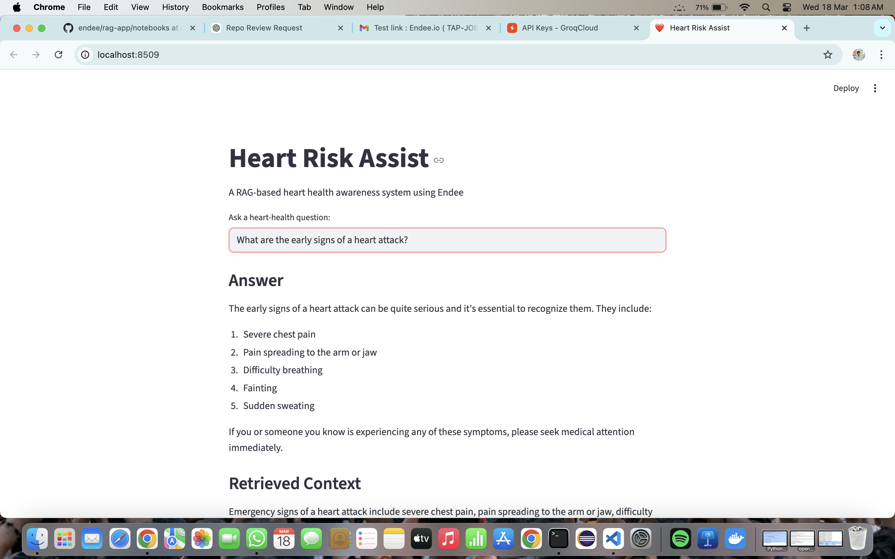

# ❤️ Heart Risk Assist

### A RAG-based Heart Health Awareness System using Endee

---

## 📌 Overview

Heart Risk Assist is an AI-powered heart health awareness assistant built using the Endee vector database. It allows users to ask questions about heart disease and receive relevant, context-based answers using Retrieval-Augmented Generation (RAG).

---

## ❗ Problem Statement

Heart diseases are one of the leading causes of death worldwide. Many people lack awareness of early symptoms, risk factors, and preventive measures. This project aims to provide accessible and reliable heart health information through an AI assistant.

---

## 🚀 Features

* Ask heart health related questions
* Retrieves relevant medical context
* Generates AI-based responses
* Simple and interactive UI using Streamlit

---

## 🛠️ Tech Stack

* Endee (Vector Database)
* Python
* Streamlit
* Groq API (LLM)

---

## 🧠 Architecture

User Question → Context Retrieval → Endee → LLM → Response

---

## 📂 Project Structure

```
rag-app/
  ├── app.py
  ├── query.py
  ├── ingest.py
  ├── data/
  ├── assets/
```

---

## ⚙️ How to Run

1. Clone the repository
2. Navigate to the project folder

   ```
   cd rag-app
   ```
3. Install dependencies

   ```
   pip install -r requirements.txt
   ```
4. Create `.env` file and add your API key

   ```
   GROQ_API_KEY=your_api_key_here
   ```
5. Run the application

   ```
   streamlit run app.py
   ```

---

## 💬 Sample Questions

* What are early signs of a heart attack?
* What are major risk factors for heart disease?
* How can lifestyle changes reduce heart risk?

---

## 📸 Screenshot



---

## ⚠️ Disclaimer

This project is for educational and awareness purposes only. It does not provide medical diagnosis or treatment advice.

---
